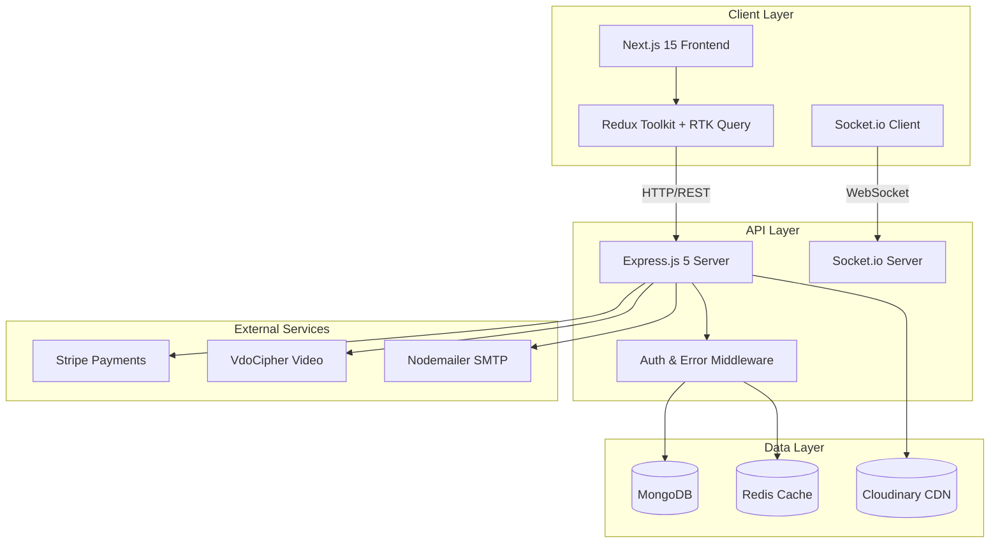
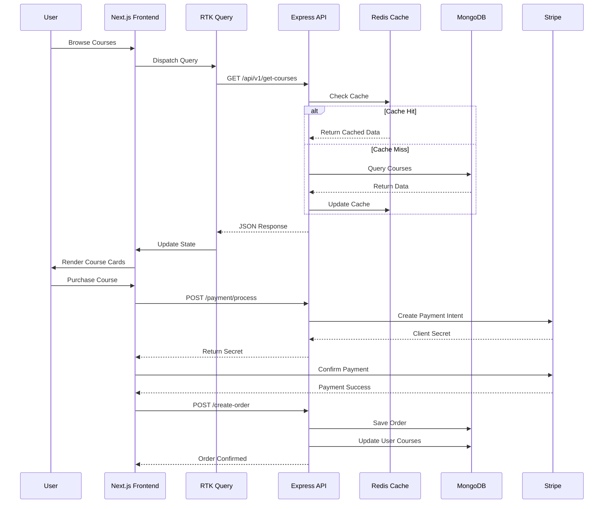
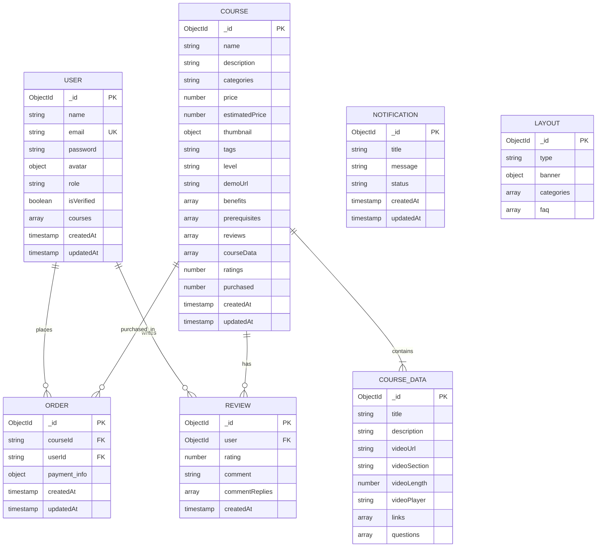
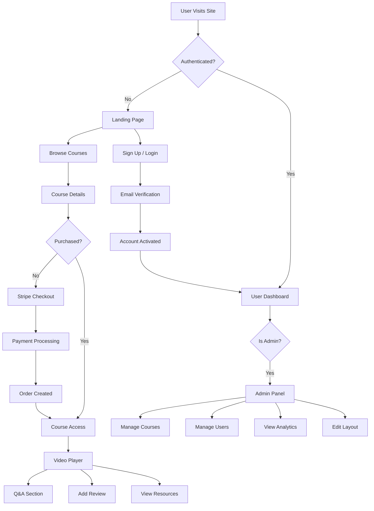

# LMS - Learning Management System

## Overview

**LMS** is a modern, full-stack **Learning Management System** designed to deliver high-quality online education. Built with **Next.js 15** and **React 19** on the frontend, and **Node.js/Express 5** with **TypeScript** on the backend, this platform provides a seamless experience for students, instructors, and administrators.

The system features **secure authentication**, **video-based course delivery**, **Stripe payment integration**, **real-time notifications**, and a comprehensive **admin dashboard** for managing courses, users, and analytics.

---

## Project Goals

**LMS** empowers learners and educators through:

- **Accessible Education** — Deliver expert-led courses to students worldwide with an intuitive, responsive interface
- **Seamless Learning Experience** — Video streaming, Q&A discussions, reviews, and progress tracking in one platform  
- **Secure Transactions** — Stripe-powered payments with robust order management
- **Real-time Engagement** — Socket.io notifications keep admins informed of purchases, reviews, and discussions
- **Scalable Architecture** — MongoDB + Redis caching ensures performance at scale

---

## Tech Stack

### Frontend
| Technology | Version | Purpose |
|------------|---------|---------|
| Next.js | 15.5.5 | React framework with App Router |
| React | 19.1.0 | UI library |
| TypeScript | 5.x | Type safety |
| Redux Toolkit | 2.10.1 | State management |
| RTK Query | - | API data fetching & caching |
| Tailwind CSS | 3.4.18 | Utility-first styling |
| Material-UI | 7.3.5 | Component library |
| NextAuth | 4.24.13 | Authentication |
| Socket.io Client | 4.8.3 | Real-time communication |
| Stripe.js | 8.6.0 | Payment processing |
| Recharts | 3.5.1 | Analytics charts |
| Formik + Yup | - | Form handling & validation |

### Backend
| Technology | Version | Purpose |
|------------|---------|---------|
| Node.js | 18.x+ | Runtime environment |
| Express.js | 5.2.1 | Web framework |
| TypeScript | 5.9.2 | Type safety |
| MongoDB + Mongoose | 8.18.2 | Database & ODM |
| Redis (ioredis) | 5.8.0 | Caching & sessions |
| JWT | 9.0.2 | Token authentication |
| bcryptjs | 3.0.2 | Password hashing |
| Stripe | 20.1.0 | Payment processing |
| Socket.io | 4.8.3 | Real-time notifications |
| Cloudinary | 2.7.0 | Media storage |
| Nodemailer | 7.0.6 | Email service |
| node-cron | 4.2.1 | Scheduled tasks |

---

## System Architecture



---

## Project Structure

```
LMS/
├── client/                          # Next.js Frontend
│   ├── app/
│   │   ├── admin/                   # Admin dashboard pages
│   │   │   ├── courses/             # Course management
│   │   │   ├── users/               # User management
│   │   │   ├── create-course/       # Course creation
│   │   │   ├── edit-course/[id]/    # Course editing
│   │   │   ├── categories/          # Category management
│   │   │   ├── faq/                 # FAQ management
│   │   │   ├── hero/                # Hero section editor
│   │   │   ├── invoices/            # Order invoices
│   │   │   ├── team/                # Team management
│   │   │   └── *-analytics/         # Analytics dashboards
│   │   ├── components/
│   │   │   ├── Admin/               # Admin components
│   │   │   ├── Auth/                # Login, SignUp, Verification
│   │   │   ├── Courses/             # Course display components
│   │   │   ├── Payment/             # Stripe checkout
│   │   │   ├── Profile/             # User profile
│   │   │   ├── Review/              # Review cards
│   │   │   └── Route/               # Landing page sections
│   │   ├── course/[id]/             # Course detail page
│   │   ├── course-access/[id]/      # Purchased course access
│   │   ├── courses/                 # Course catalog
│   │   ├── profile/                 # User profile page
│   │   ├── hooks/                   # Custom React hooks
│   │   ├── styles/                  # Style utilities
│   │   └── utils/                   # Helper components
│   ├── redux/
│   │   ├── features/
│   │   │   ├── api/apiSlice.ts      # Base API configuration
│   │   │   ├── auth/                # Authentication state
│   │   │   ├── courses/             # Course API endpoints
│   │   │   ├── orders/              # Order API endpoints
│   │   │   ├── analytics/           # Analytics API
│   │   │   ├── layout/              # Layout API
│   │   │   ├── notifications/       # Notifications API
│   │   │   └── user/                # User API endpoints
│   │   └── store.ts                 # Redux store config
│   └── public/                      # Static assets
│
└── server/                          # Express.js Backend
    ├── controllers/
    │   ├── user.controller.ts       # User authentication & management
    │   ├── course.controller.ts     # Course CRUD & interactions
    │   ├── order.controller.ts      # Order & payment processing
    │   ├── notification.controller.ts
    │   ├── analytics.controller.ts
    │   └── layout.controller.ts
    ├── models/
    │   ├── user.model.ts            # User schema with JWT methods
    │   ├── course.model.ts          # Course, reviews, Q&A schemas
    │   ├── order.model.ts           # Order schema
    │   ├── layout.model.ts          # Banner, FAQ, categories
    │   └── notificationModel.ts
    ├── routes/
    │   ├── user.route.ts            # /api/v1/user/*
    │   ├── course.route.ts          # /api/v1/course/*
    │   ├── order.route.ts           # /api/v1/order/*
    │   ├── notification.route.ts
    │   ├── analytics.route.ts
    │   └── layout.route.ts
    ├── middleware/
    │   ├── auth.ts                  # JWT verification & role authorization
    │   ├── error.ts                 # Global error handler
    │   └── catchAsyncErrors.ts      # Async error wrapper
    ├── services/
    │   ├── user.service.ts
    │   ├── course.service.ts
    │   └── order.service.ts
    ├── utils/
    │   ├── db.ts                    # MongoDB connection
    │   ├── redis.ts                 # Redis client
    │   ├── jwt.ts                   # Token utilities
    │   ├── sendMail.ts              # Email service
    │   ├── analytics.generator.ts   # Analytics data generation
    │   └── ErrorHandler.ts          # Custom error class
    ├── mails/                       # EJS email templates
    ├── @types/                      # TypeScript declarations
    ├── app.ts                       # Express app configuration
    ├── server.ts                    # Server entry point
    └── socketServer.ts              # Socket.io configuration
```

---

## API Endpoints

### User Routes (`/api/v1`)
| Method | Endpoint | Description | Auth |
|--------|----------|-------------|------|
| POST | `/registration` | Register new user | - |
| POST | `/activate-user` | Activate account via OTP | - |
| POST | `/login` | User login | - |
| GET | `/logout` | User logout | ✓ |
| GET | `/refresh` | Refresh access token | - |
| GET | `/me` | Get current user info | ✓ |
| POST | `/social-auth` | Social login (Google/GitHub) | - |
| PUT | `/update-user-info` | Update profile | ✓ |
| PUT | `/update-user-password` | Change password | ✓ |
| PUT | `/update-user-avatar` | Update avatar | ✓ |
| GET | `/get-all-users` | List all users | Admin |
| PUT | `/update-user-role` | Change user role | Admin |
| DELETE | `/delete-user/:id` | Delete user | Admin |

### Course Routes (`/api/v1`)
| Method | Endpoint | Description | Auth |
|--------|----------|-------------|------|
| POST | `/create-course` | Create new course | Admin |
| PUT | `/edit-course/:id` | Update course | Admin |
| GET | `/get-course/:id` | Get course (public) | - |
| GET | `/get-courses` | List all courses | - |
| GET | `/get-course-content/:id` | Get full content | ✓ (Purchased) |
| PUT | `/add-question` | Ask question | ✓ |
| PUT | `/add-answer` | Answer question | ✓ |
| PUT | `/add-review/:id` | Add review | ✓ |
| PUT | `/add-reply/:id` | Reply to review | Admin |
| GET | `/get-all-courses` | Admin course list | Admin |
| POST | `/getVdoCipherOTP` | Get video OTP | - |
| DELETE | `/delete-course/:id` | Delete course | Admin |

### Order Routes (`/api/v1`)
| Method | Endpoint | Description | Auth |
|--------|----------|-------------|------|
| POST | `/create-order` | Create order | ✓ |
| GET | `/get-all-orders` | List all orders | Admin |
| GET | `/payment/stripePublishAbleKey` | Get Stripe key | - |
| POST | `/payment/process` | Process payment | ✓ |

---

## Data Flow



---

## Database Schema



---

## Key Features

### 🎓 Course Management
- **Multi-step course creation** with name, description, pricing, tags, categories, difficulty level
- **Video content structure** with sections, lessons, and resource links
- **Benefits & prerequisites** for clear learning outcomes
- **Full CRUD operations** via admin dashboard

### 💳 Payment & Enrollment
- **Stripe integration** for secure payment processing
- **Purchase verification** restricts content to enrolled users
- **Order tracking** with payment history

### 📚 Learning Experience
- **Video player** with navigation controls
- **Q&A system** for course discussions
- **Review & rating system** with admin replies
- **Course search & filtering** by category

### 🔔 Real-time Notifications
- **Socket.io integration** for instant updates
- **Purchase notifications** to admins
- **New review alerts**
- **Q&A activity notifications**

### 🛡️ Security
- **JWT authentication** with access (30min) & refresh (7 days) tokens
- **bcrypt password hashing**
- **Role-based authorization** (user/admin)
- **CORS configuration** for secure cross-origin requests

### 📊 Admin Dashboard
- **User management** with role assignment
- **Course analytics** with Recharts visualizations
- **Order analytics** and invoices
- **Layout customization** (hero, FAQ, categories)

---

## Application Flow



---

## Getting Started

### Prerequisites
- Node.js 18.x or higher
- MongoDB instance
- Redis server
- Stripe account
- Cloudinary account

### Environment Variables

**Server (.env)**
```env
PORT=8000
NODE_ENV=development
MONGODB_URL=mongodb://localhost:27017/lms
REDIS_URL=redis://localhost:6379
ACCESS_TOKEN=your_access_token_secret
REFRESH_TOKEN=your_refresh_token_secret
ACCESS_TOKEN_EXPIRE=30
REFRESH_TOKEN_EXPIRE=7
CLOUDINARY_CLOUD_NAME=your_cloud_name
CLOUDINARY_API_KEY=your_api_key
CLOUDINARY_API_SECRET=your_api_secret
STRIPE_SECRET_KEY=sk_test_...
STRIPE_PUBLISHABLE_KEY=pk_test_...
SMTP_HOST=smtp.gmail.com
SMTP_PORT=465
SMTP_SERVICE=gmail
SMTP_MAIL=your_email
SMTP_PASSWORD=your_app_password
CLIENT_URL=http://localhost:3000
```

**Client (.env.local)**
```env
NEXT_PUBLIC_SERVER_URL=http://localhost:8000/api/v1/
NEXT_PUBLIC_SOCKET_SERVER_URI=http://localhost:8000
NEXTAUTH_SECRET=your_nextauth_secret
GOOGLE_CLIENT_ID=your_google_client_id
GOOGLE_CLIENT_SECRET=your_google_client_secret
GITHUB_CLIENT_ID=your_github_client_id
GITHUB_CLIENT_SECRET=your_github_client_secret
```

### Installation

```bash
# Clone the repository
git clone https://github.com/yourusername/lms.git
cd lms

# Install server dependencies
cd server
npm install

# Install client dependencies
cd ../client
npm install
```

### Running the Application

```bash
# Start the backend server (from /server)
npm run dev

# Start the frontend (from /client)
npm run dev
```

- Frontend: http://localhost:3000
- Backend API: http://localhost:8000

---

## Challenges & Solutions

| Challenge | Solution |
|-----------|----------|
| JWT token lifecycle management | Implemented automatic token rotation with 30min access / 7 day refresh tokens |
| Cache invalidation after mutations | Added Redis cache updates after database mutations |
| VdoCipher video integration | Debugged API flow and implemented OTP-based video access |
| TypeScript model relationships | Used proper interface definitions and Mongoose schema typing |
| Real-time notification delivery | Integrated Socket.io with broadcast events to admin dashboard |
| Responsive admin dashboard | Used MUI DataGrid with custom responsive configurations |

---

## Best Practices Implemented

✅ **TypeScript Throughout** — Full type safety across frontend and backend  
✅ **Secure Authentication** — JWT with access/refresh token rotation  
✅ **RTK Query Caching** — Efficient API state management with automatic cache invalidation  
✅ **Layered Architecture** — Clear separation: routes → controllers → services → models  
✅ **Error Handling** — Global error middleware with custom error classes  
✅ **Real-time Updates** — Socket.io for live notifications  
✅ **Responsive Design** — Mobile-first approach with Tailwind CSS  
✅ **Theme Support** — Dark/light mode with smooth transitions  

---

## Conclusion

**LMS** is a production-ready Learning Management System that combines modern web technologies to deliver an exceptional online education experience. With its robust authentication system, seamless payment integration, real-time notifications, and comprehensive admin tools, it provides everything needed to run a successful online learning platform.

The TypeScript-based architecture ensures maintainability and scalability, while the combination of Next.js 15, Redux Toolkit, and Express 5 delivers optimal performance for both students and administrators.

---

## License

ISC License

## Author

Ali Shair

