# 🎓 LMS - Learning Management System

<div align="center">


[](https://nextjs.org/)
[](https://reactjs.org/)
[](https://expressjs.com/)
[](https://www.typescriptlang.org/)
[](https://www.mongodb.com/)
[](https://redis.io/)
[](https://socket.io/)
[](https://stripe.com/)

[](https://opensource.org/licenses/ISC)
[](http://makeapullrequest.com)

**A modern, full-stack Learning Management System for delivering high-quality online education**

[Features](#-key-features) • [Demo](#-demo) • [Installation](#-installation) • [Documentation](#-documentation) • [Contributing](#-contributing)

</div>

---

## 📋 Table of Contents

- [Problem Statement](#-problem-statement)
- [Our Solution](#-our-solution)
- [Key Features](#-key-features)
- [Tech Stack](#-tech-stack)
- [System Architecture](#-system-architecture)
- [UML Diagrams](#-uml-diagrams)
- [Class Diagrams](#-class-diagrams)
- [Database Schema](#-database-schema)
- [API Documentation](#-api-documentation)
- [Installation](#-installation)
- [Configuration](#-configuration)
- [Usage](#-usage)
- [Project Structure](#-project-structure)
- [Contributing](#-contributing)
- [Roadmap](#-roadmap)
- [License](#-license)
- [Author](#-author)
- [Acknowledgments](#-acknowledgments)

---

## 🎯 Problem Statement

### The Challenge in Online Education

The modern education landscape faces several critical challenges that hinder effective online learning:

| Problem | Impact |
|---------|--------|
| **Fragmented Learning Platforms** | Students juggle multiple tools for videos, assignments, discussions, and payments |
| **Poor User Experience** | Complex interfaces discourage learners and reduce course completion rates |
| **Limited Instructor-Student Interaction** | Lack of real-time communication creates disconnect in online learning |
| **Insecure Payment Processing** | Trust issues with payment handling reduce course enrollments |
| **No Centralized Progress Tracking** | Students and admins lack visibility into learning progress |
| **Scalability Issues** | Traditional platforms struggle with growing user bases |
| **Lack of Analytics** | Instructors can't measure course effectiveness or student engagement |

### Real-World Consequences

```
📉 60% of online learners drop out before completing courses
💸 $107 billion lost annually due to poor e-learning experiences  
⏰ Students spend 40% more time navigating platforms than learning
🔒 23% of potential students abandon purchases due to payment security concerns
```

---

## 💡 Our Solution

**LMS** addresses these challenges with a comprehensive, integrated platform:

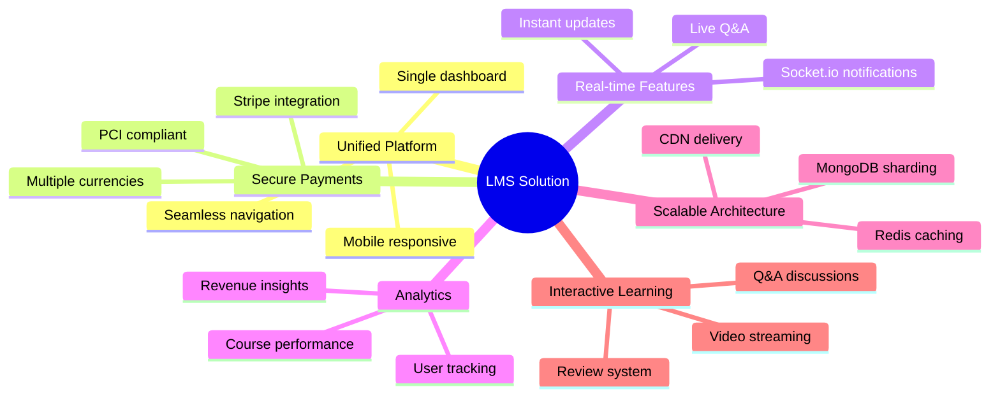

### How LMS Solves Each Problem

| Problem | LMS Solution |
|---------|--------------|
| **Fragmented Platforms** | All-in-one system: courses, payments, discussions, analytics in one place |
| **Poor UX** | Modern Next.js frontend with intuitive navigation and dark/light themes |
| **Limited Interaction** | Real-time Q&A, review replies, and Socket.io notifications |
| **Payment Security** | Stripe integration with PCI-DSS compliance and secure token handling |
| **No Progress Tracking** | User dashboard with enrolled courses and completion status |
| **Scalability** | Redis caching, MongoDB indexing, and Cloudinary CDN for media |
| **Lack of Analytics** | Comprehensive admin dashboard with Recharts visualizations |

---

## ✨ Key Features

<table>
<tr>
<td width="50%">

### 🎓 For Students
- ✅ Browse and search courses by category
- ✅ Secure Stripe payment checkout
- ✅ HD video streaming with VdoCipher
- ✅ Interactive Q&A with instructors
- ✅ Course reviews and ratings
- ✅ Personal profile management
- ✅ Social login (Google, GitHub)
- ✅ Email verification with OTP

</td>
<td width="50%">

### 👨‍💼 For Administrators
- ✅ Multi-step course creation wizard
- ✅ User management with role assignment
- ✅ Real-time purchase notifications
- ✅ Revenue and user analytics
- ✅ Layout customization (Hero, FAQ)
- ✅ Order and invoice management
- ✅ Review moderation and replies
- ✅ Category management

</td>
</tr>
</table>

### 🔐 Security Features
- **JWT Authentication** — Access tokens (30min) + Refresh tokens (7 days)
- **Password Hashing** — bcrypt with salt rounds
- **Role-Based Access** — User and Admin authorization
- **CORS Protection** — Configured origin whitelist
- **Rate Limiting** — API request throttling

### 🚀 Performance Features
- **Redis Caching** — Reduced database load
- **Cloudinary CDN** — Fast media delivery
- **Turbopack** — Lightning-fast Next.js builds
- **RTK Query** — Automatic request caching and deduplication

---

## 🛠 Tech Stack

### Frontend Architecture

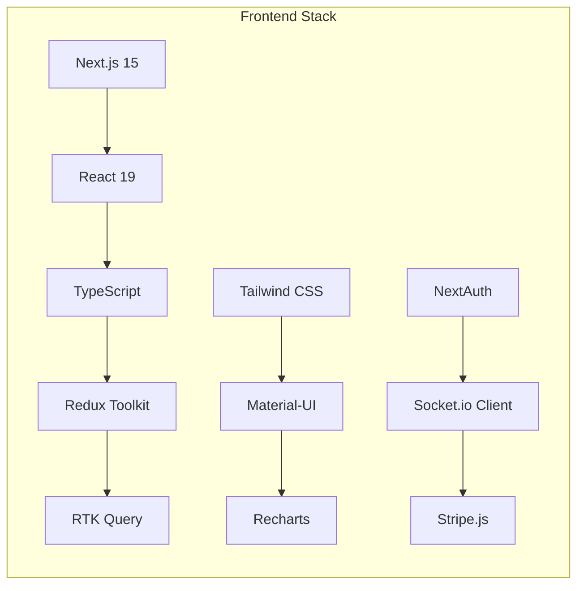

### Backend Architecture

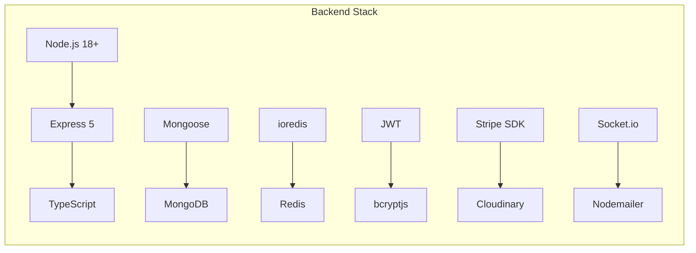

### Complete Technology Matrix

| Layer | Technology | Version | Purpose |
|-------|------------|---------|---------|
| **Frontend Framework** | Next.js | 15.5.5 | React framework with App Router |
| **UI Library** | React | 19.1.0 | Component-based UI |
| **Type Safety** | TypeScript | 5.x | Static type checking |
| **State Management** | Redux Toolkit | 2.10.1 | Global state management |
| **API Layer** | RTK Query | - | Data fetching & caching |
| **Styling** | Tailwind CSS | 3.4.18 | Utility-first CSS |
| **Component Library** | Material-UI | 7.3.5 | Pre-built components |
| **Charts** | Recharts | 3.5.1 | Analytics visualizations |
| **Authentication** | NextAuth | 4.24.13 | OAuth & session management |
| **Real-time** | Socket.io | 4.8.3 | WebSocket communication |
| **Payments** | Stripe | 20.1.0 | Payment processing |
| **Backend Framework** | Express.js | 5.2.1 | REST API server |
| **Database** | MongoDB | - | Document database |
| **ODM** | Mongoose | 8.18.2 | MongoDB object modeling |
| **Caching** | Redis | 5.8.0 | In-memory data store |
| **Media Storage** | Cloudinary | 2.7.0 | Cloud media management |
| **Email** | Nodemailer | 7.0.6 | SMTP email service |
| **Video** | VdoCipher | - | Secure video streaming |

---

## 🏗 System Architecture

### High-Level Architecture

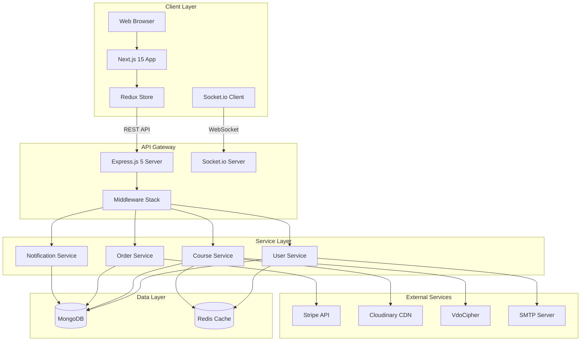

### Request-Response Flow

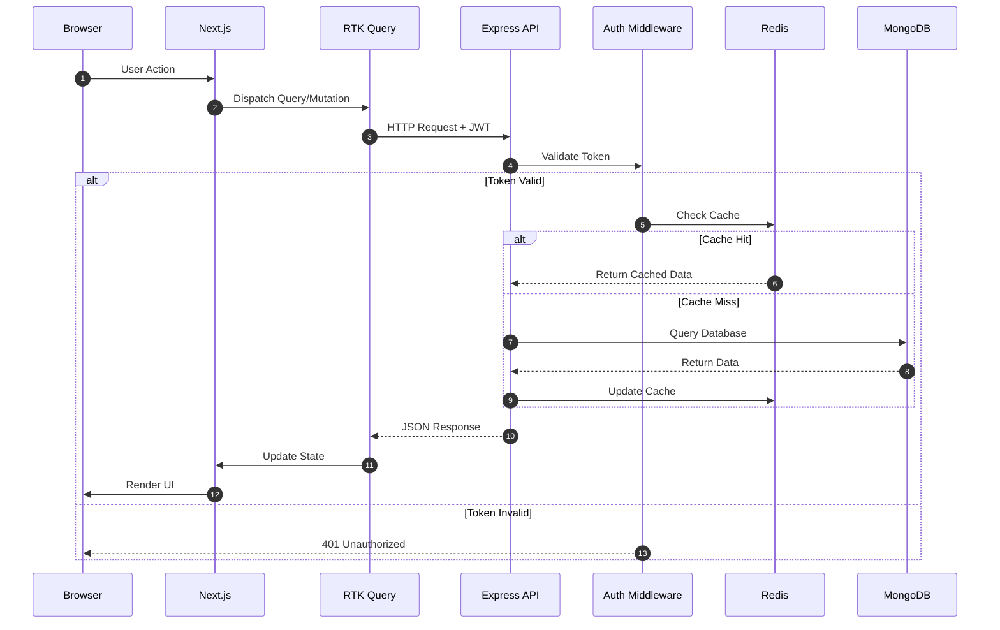

---

## 📐 UML Diagrams

### Use Case Diagram

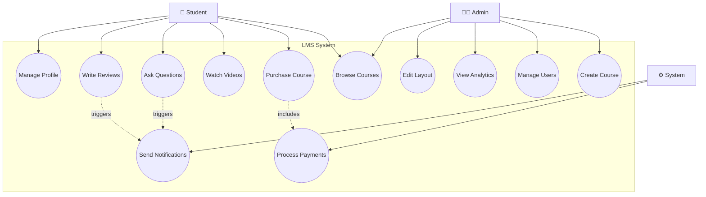

### Activity Diagram - Course Purchase Flow

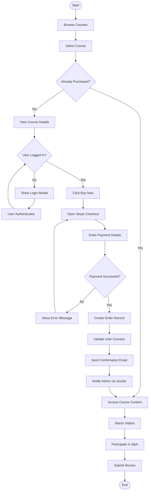

### State Diagram - User Authentication

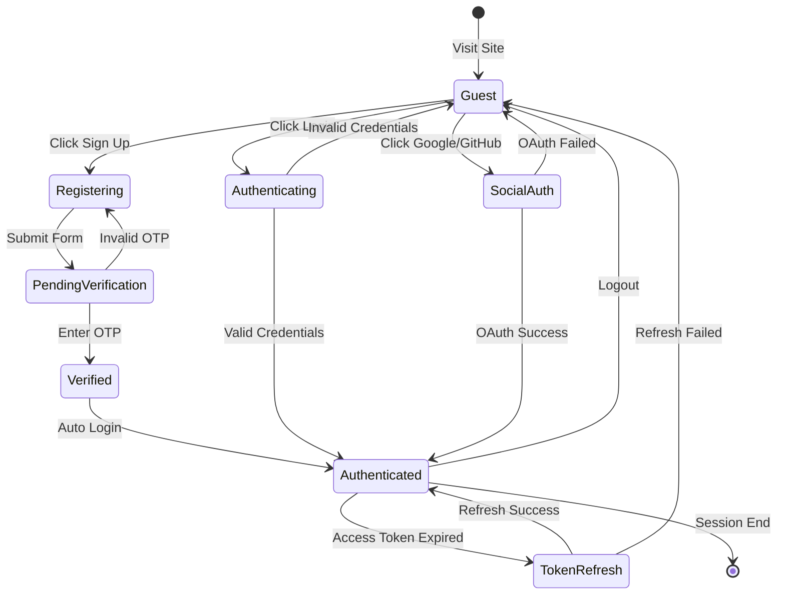

### Sequence Diagram - Video Access

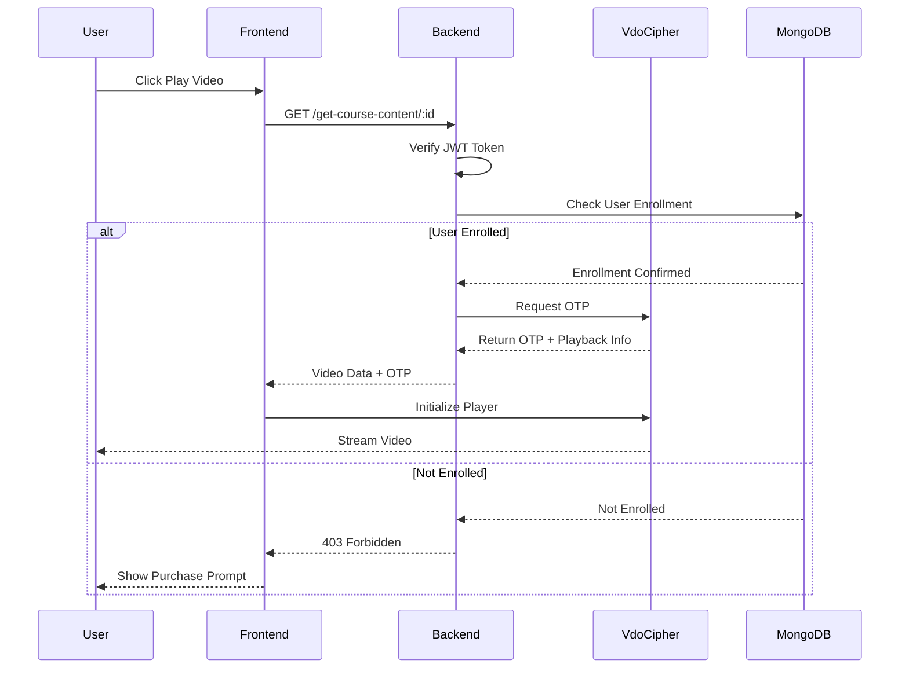

---

## 📊 Class Diagrams

### Domain Model Class Diagram

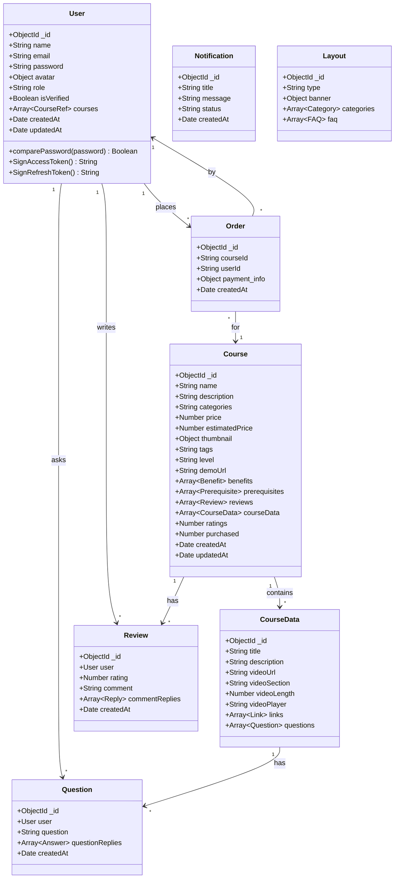

### Service Layer Class Diagram

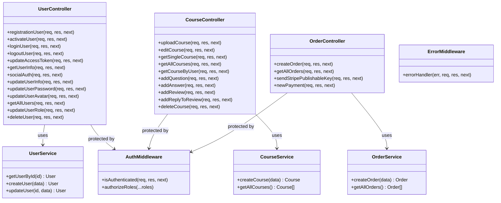

### Frontend Component Hierarchy

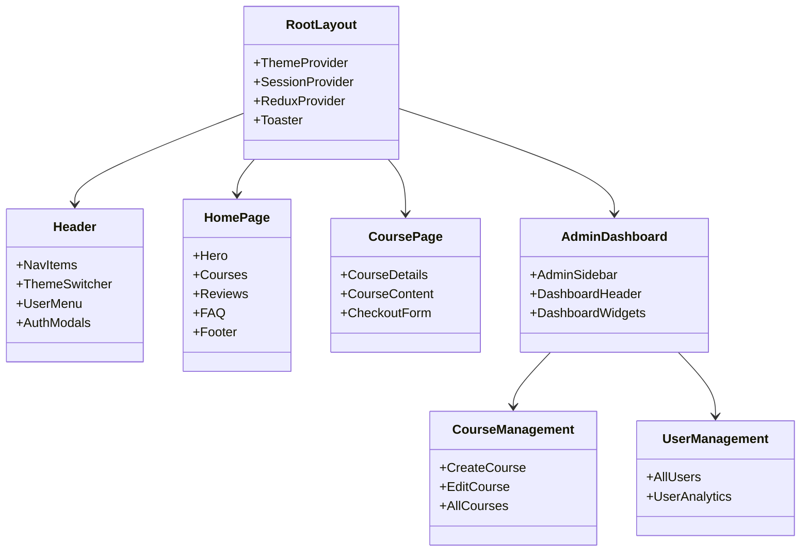

---

## 🗄 Database Schema

### Entity Relationship Diagram

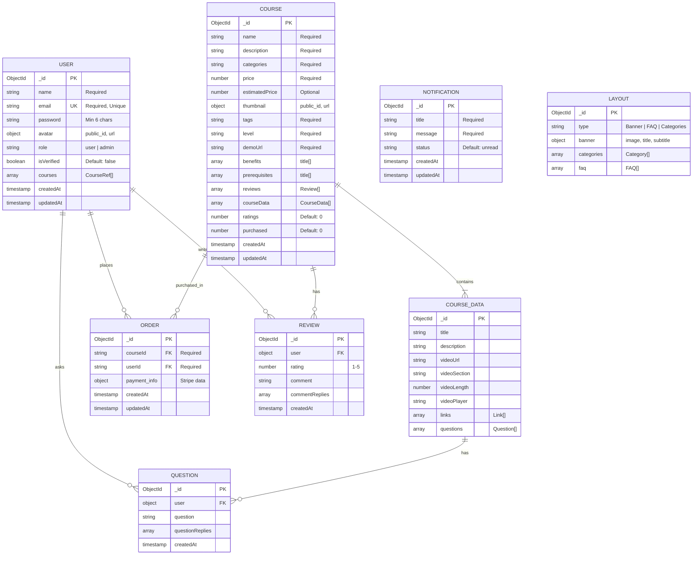

---

## 📡 API Documentation

### Authentication Endpoints

| Method | Endpoint | Description | Auth | Request Body |
|--------|----------|-------------|------|--------------|
| `POST` | `/api/v1/registration` | Register new user | ❌ | `{name, email, password}` |
| `POST` | `/api/v1/activate-user` | Verify OTP | ❌ | `{activation_token, activation_code}` |
| `POST` | `/api/v1/login` | User login | ❌ | `{email, password}` |
| `GET` | `/api/v1/logout` | User logout | ✅ | - |
| `GET` | `/api/v1/refresh` | Refresh token | ❌ | - |
| `GET` | `/api/v1/me` | Get current user | ✅ | - |
| `POST` | `/api/v1/social-auth` | OAuth login | ❌ | `{email, name, avatar}` |

### User Management Endpoints

| Method | Endpoint | Description | Auth | Role |
|--------|----------|-------------|------|------|
| `PUT` | `/api/v1/update-user-info` | Update profile | ✅ | User |
| `PUT` | `/api/v1/update-user-password` | Change password | ✅ | User |
| `PUT` | `/api/v1/update-user-avatar` | Update avatar | ✅ | User |
| `GET` | `/api/v1/get-all-users` | List all users | ✅ | Admin |
| `PUT` | `/api/v1/update-user-role` | Change user role | ✅ | Admin |
| `DELETE` | `/api/v1/delete-user/:id` | Delete user | ✅ | Admin |

### Course Endpoints

| Method | Endpoint | Description | Auth | Role |
|--------|----------|-------------|------|------|
| `POST` | `/api/v1/create-course` | Create course | ✅ | Admin |
| `PUT` | `/api/v1/edit-course/:id` | Update course | ✅ | Admin |
| `GET` | `/api/v1/get-course/:id` | Get course (public) | ❌ | - |
| `GET` | `/api/v1/get-courses` | List all courses | ❌ | - |
| `GET` | `/api/v1/get-course-content/:id` | Get full content | ✅ | Enrolled |
| `PUT` | `/api/v1/add-question` | Ask question | ✅ | User |
| `PUT` | `/api/v1/add-answer` | Answer question | ✅ | User |
| `PUT` | `/api/v1/add-review/:id` | Add review | ✅ | User |
| `PUT` | `/api/v1/add-reply/:id` | Reply to review | ✅ | Admin |
| `DELETE` | `/api/v1/delete-course/:id` | Delete course | ✅ | Admin |

### Order & Payment Endpoints

| Method | Endpoint | Description | Auth |
|--------|----------|-------------|------|
| `POST` | `/api/v1/create-order` | Create order | ✅ |
| `GET` | `/api/v1/get-all-orders` | List all orders | ✅ Admin |
| `GET` | `/api/v1/payment/stripePublishAbleKey` | Get Stripe key | ❌ |
| `POST` | `/api/v1/payment/process` | Process payment | ✅ |

---

## 🚀 Installation

### Prerequisites

Before you begin, ensure you have the following installed:

- **Node.js** 18.x or higher ([Download](https://nodejs.org/))
- **MongoDB** 6.x or higher ([Download](https://www.mongodb.com/try/download/community))
- **Redis** 7.x or higher ([Download](https://redis.io/download/))
- **Git** ([Download](https://git-scm.com/))

### Clone the Repository

```bash
git clone https://github.com/alishair/lms.git
cd lms
```

### Install Dependencies

```bash
# Install server dependencies
cd server
npm install

# Install client dependencies
cd ../client
npm install
```

### Quick Start

```bash
# Terminal 1: Start MongoDB (if not running as service)
mongod

# Terminal 2: Start Redis (if not running as service)
redis-server

# Terminal 3: Start Backend Server
cd server
npm run dev

# Terminal 4: Start Frontend
cd client
npm run dev
```

🎉 Open [http://localhost:3000](http://localhost:3000) to view the application!

---

## ⚙️ Configuration

### Server Environment Variables

Create a `.env` file in the `/server` directory:

```env
# Server Configuration
PORT=8000
NODE_ENV=development

# Database
MONGODB_URL=mongodb://localhost:27017/lms

# Redis
REDIS_URL=redis://localhost:6379

# JWT Secrets
ACCESS_TOKEN=your_access_token_secret_key_here
REFRESH_TOKEN=your_refresh_token_secret_key_here
ACCESS_TOKEN_EXPIRE=30
REFRESH_TOKEN_EXPIRE=7

# Cloudinary (Media Storage)
CLOUDINARY_CLOUD_NAME=your_cloud_name
CLOUDINARY_API_KEY=your_api_key
CLOUDINARY_API_SECRET=your_api_secret

# Stripe (Payments)
STRIPE_SECRET_KEY=sk_test_xxxxxxxxxxxxx
STRIPE_PUBLISHABLE_KEY=pk_test_xxxxxxxxxxxxx

# SMTP (Email)
SMTP_HOST=smtp.gmail.com
SMTP_PORT=465
SMTP_SERVICE=gmail
SMTP_MAIL=your_email@gmail.com
SMTP_PASSWORD=your_app_password

# VdoCipher (Video)
VDOCIPHER_API_SECRET=your_vdocipher_secret

# Client URL
CLIENT_URL=http://localhost:3000
```

### Client Environment Variables

Create a `.env.local` file in the `/client` directory:

```env
# API Configuration
NEXT_PUBLIC_SERVER_URL=http://localhost:8000/api/v1/
NEXT_PUBLIC_SOCKET_SERVER_URI=http://localhost:8000

# NextAuth
NEXTAUTH_SECRET=your_nextauth_secret_key

# OAuth Providers
GOOGLE_CLIENT_ID=your_google_client_id
GOOGLE_CLIENT_SECRET=your_google_client_secret
GITHUB_CLIENT_ID=your_github_client_id
GITHUB_CLIENT_SECRET=your_github_client_secret

# Stripe
NEXT_PUBLIC_STRIPE_PUBLISHABLE_KEY=pk_test_xxxxxxxxxxxxx
```

---

## 📖 Usage

### For Students

1. **Register** — Create an account with email verification
2. **Browse** — Explore courses by category or search
3. **Purchase** — Secure checkout with Stripe
4. **Learn** — Watch videos, ask questions, track progress
5. **Review** — Rate and review completed courses

### For Administrators

1. **Login** — Access admin dashboard with admin credentials
2. **Create Courses** — Multi-step wizard for course creation
3. **Manage Users** — View, edit roles, or delete users
4. **Monitor** — Track analytics and real-time notifications
5. **Customize** — Edit hero banner, FAQ, and categories

---

## 📁 Project Structure

```
LMS/
├── 📂 client/                       # Next.js Frontend
│   ├── 📂 app/
│   │   ├── 📂 admin/                # Admin pages
│   │   │   ├── 📂 courses/
│   │   │   ├── 📂 users/
│   │   │   ├── 📂 create-course/
│   │   │   ├── 📂 edit-course/[id]/
│   │   │   ├── 📂 categories/
│   │   │   ├── 📂 faq/
│   │   │   ├── 📂 hero/
│   │   │   ├── 📂 invoices/
│   │   │   ├── 📂 team/
│   │   │   └── 📂 *-analytics/
│   │   ├── 📂 components/
│   │   │   ├── 📂 Admin/
│   │   │   ├── 📂 Auth/
│   │   │   ├── 📂 Courses/
│   │   │   ├── 📂 Payment/
│   │   │   ├── 📂 Profile/
│   │   │   ├── 📂 Review/
│   │   │   └── 📂 Route/
│   │   ├── 📂 course/[id]/
│   │   ├── 📂 course-access/[id]/
│   │   ├── 📂 courses/
│   │   ├── 📂 profile/
│   │   ├── 📂 hooks/
│   │   ├── 📂 styles/
│   │   └── 📂 utils/
│   ├── 📂 redux/
│   │   ├── 📂 features/
│   │   │   ├── 📂 api/
│   │   │   ├── 📂 auth/
│   │   │   ├── 📂 courses/
│   │   │   ├── 📂 orders/
│   │   │   ├── 📂 analytics/
│   │   │   ├── 📂 layout/
│   │   │   ├── 📂 notifications/
│   │   │   └── 📂 user/
│   │   └── 📄 store.ts
│   ├── 📂 public/
│   ├── 📄 package.json
│   └── 📄 tailwind.config.ts
│
├── 📂 server/                       # Express.js Backend
│   ├── 📂 controllers/
│   │   ├── 📄 user.controller.ts
│   │   ├── 📄 course.controller.ts
│   │   ├── 📄 order.controller.ts
│   │   ├── 📄 notification.controller.ts
│   │   ├── 📄 analytics.controller.ts
│   │   └── 📄 layout.controller.ts
│   ├── 📂 models/
│   │   ├── 📄 user.model.ts
│   │   ├── 📄 course.model.ts
│   │   ├── 📄 order.model.ts
│   │   ├── 📄 layout.model.ts
│   │   └── 📄 notificationModel.ts
│   ├── 📂 routes/
│   │   ├── 📄 user.route.ts
│   │   ├── 📄 course.route.ts
│   │   ├── 📄 order.route.ts
│   │   ├── 📄 notification.route.ts
│   │   ├── 📄 analytics.route.ts
│   │   └── 📄 layout.route.ts
│   ├── 📂 middleware/
│   │   ├── 📄 auth.ts
│   │   ├── 📄 error.ts
│   │   └── 📄 catchAsyncErrors.ts
│   ├── 📂 services/
│   │   ├── 📄 user.service.ts
│   │   ├── 📄 course.service.ts
│   │   └── 📄 order.service.ts
│   ├── 📂 utils/
│   │   ├── 📄 db.ts
│   │   ├── 📄 redis.ts
│   │   ├── 📄 jwt.ts
│   │   ├── 📄 sendMail.ts
│   │   ├── 📄 analytics.generator.ts
│   │   └── 📄 ErrorHandler.ts
│   ├── 📂 mails/
│   ├── 📂 @types/
│   ├── 📄 app.ts
│   ├── 📄 server.ts
│   ├── 📄 socketServer.ts
│   └── 📄 package.json
│
├── 📄 README.md
└── 📄 .gitignore
```

---

## 🤝 Contributing

We welcome contributions from the community! Here's how you can help:

### Getting Started

1. **Fork** the repository
2. **Clone** your fork: `git clone https://github.com/yourusername/lms.git`
3. **Create** a branch: `git checkout -b feature/amazing-feature`
4. **Make** your changes
5. **Commit**: `git commit -m 'Add amazing feature'`
6. **Push**: `git push origin feature/amazing-feature`
7. **Open** a Pull Request

### Contribution Guidelines

- Follow the existing code style and conventions
- Write meaningful commit messages
- Add tests for new features
- Update documentation as needed
- Ensure all tests pass before submitting

### Code of Conduct

Please read our [Code of Conduct](CODE_OF_CONDUCT.md) before contributing.

---

## 🗺 Roadmap

### Version 1.1 (Q2 2026)
- [ ] Course progress tracking
- [ ] Certificate generation
- [ ] Instructor dashboard
- [ ] Mobile app (React Native)

### Version 1.2 (Q3 2026)
- [ ] Live streaming classes
- [ ] Assignment submission
- [ ] Grading system
- [ ] Discussion forums

### Version 2.0 (Q4 2026)
- [ ] AI-powered recommendations
- [ ] Learning paths
- [ ] Gamification (badges, points)
- [ ] Multi-language support

---

## 📄 License

This project is licensed under the **ISC License**.

```
ISC License

Copyright (c) 2024-2026 Ali Shair

Permission to use, copy, modify, and/or distribute this software for any
purpose with or without fee is hereby granted, provided that the above
copyright notice and this permission notice appear in all copies.

THE SOFTWARE IS PROVIDED "AS IS" AND THE AUTHOR DISCLAIMS ALL WARRANTIES
WITH REGARD TO THIS SOFTWARE INCLUDING ALL IMPLIED WARRANTIES OF
MERCHANTABILITY AND FITNESS. IN NO EVENT SHALL THE AUTHOR BE LIABLE FOR
ANY SPECIAL, DIRECT, INDIRECT, OR CONSEQUENTIAL DAMAGES OR ANY DAMAGES
WHATSOEVER RESULTING FROM LOSS OF USE, DATA OR PROFITS, WHETHER IN AN
ACTION OF CONTRACT, NEGLIGENCE OR OTHER TORTIOUS ACTION, ARISING OUT OF
OR IN CONNECTION WITH THE USE OR PERFORMANCE OF THIS SOFTWARE.
```

---

## 👨‍💻 Author

<div align="center">

### Ali Shair

[](https://github.com/alishair)
[](https://linkedin.com/in/alishair)
[](mailto:alishair@example.com)

**Full-Stack Developer | Software Engineer**

*"Building solutions that make a difference, one commit at a time."*

</div>

---

## 🙏 Acknowledgments

Special thanks to:

- **Next.js Team** — For the amazing React framework
- **Vercel** — For hosting and deployment solutions
- **MongoDB** — For the flexible document database
- **Stripe** — For secure payment processing
- **VdoCipher** — For DRM-protected video streaming
- **Open Source Community** — For the countless libraries that made this possible

---

<div align="center">

**⭐ If you found this project helpful, please give it a star! ⭐**

Made with ❤️ by [Ali Shair](https://github.com/alishair)

</div>
